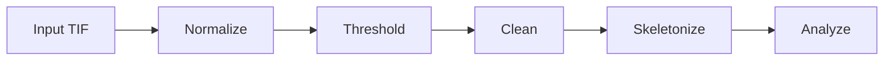
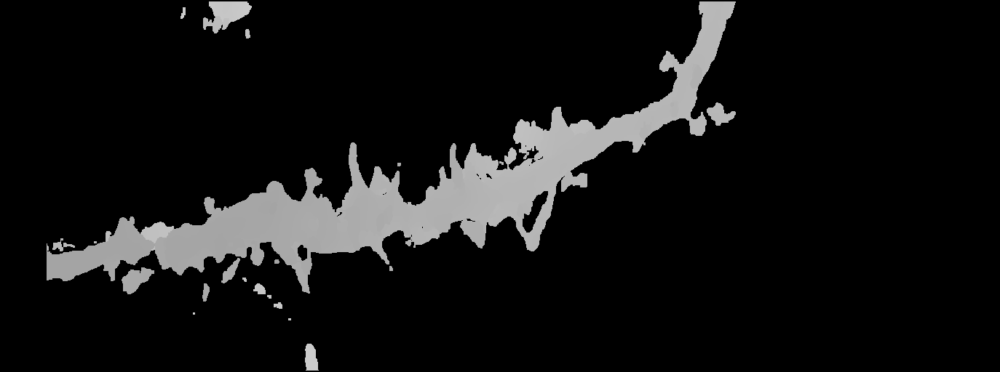
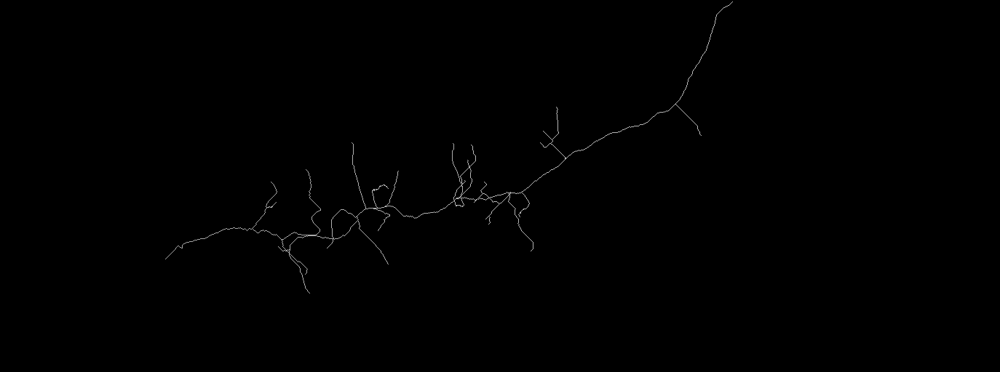
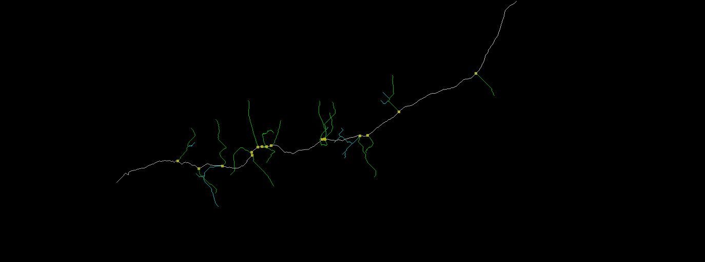
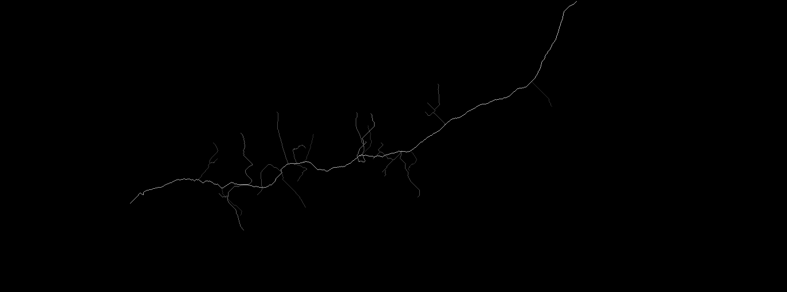

# Skeleton Pipeline

A 3D microscopy pipeline that extracts neurite skeletons from TIF volumes and measures trunk and branch lengths.

## Quick Start

1. Clone the repository
```bash
git clone https://github.com/CharlieC30/skeleton-pipeline.git
cd skeleton-pipeline
```

2. Create conda environment and install dependencies
```bash
conda create -n skeleton-pipeline python=3.10
conda activate skeleton-pipeline
pip install -r requirements.txt
```

3. Download sample data from [Google Drive](https://drive.google.com/drive/folders/1w4wIAczOLmvhfEuUUNyLAlcUoYi9cey5)
   - Place `sample_input.tif` in `data/examples/input/`
   - Example outputs are also available there for reference

4. Run the pipeline
```bash
python -m skeleton_pipeline --input data/examples/input/sample_input.tif
```

Output will be saved to `data/output/YYYYMMDD_HHMMSS/`.

## Usage

### Basic usage

Uses `skeleton_pipeline/config/examples.yaml` by default.
```bash
python -m skeleton_pipeline --input data/examples/input/sample_input.tif
```

### Use custom config
```bash
python -m skeleton_pipeline --input data/examples/input/sample_input.tif --config your_config.yaml
```

### Show all options
```bash
python -m skeleton_pipeline --help
```

## Pipeline Steps

| Step | Name | Description |
|------|------|-------------|
| 1 | Normalize | Normalize TIF and convert to uint8 |
| 2 | Threshold | Binarize using Otsu's method |
| 3 | Clean | Morphological operations |
| 4 | Skeletonize | Extract skeleton using Kimimaro |
| 5 | Analyze | Analyze main trunk and branches |



## Output Structure

```
data/output/YYYYMMDD_HHMMSS/
    config_used.yaml     # Config backup
    01_normalize/        # Normalized TIF
    02_threshold/        # Binary masks
    03_clean/            # Cleaned masks
    04_skeletonize/      # SWC + skeleton TIF
    05_analyze/          # JSON + summary TXT + labeled TIF + length TIF
```

## Demo

| Normalized |
|:---:|
|  |

| Cleaned Mask |
|:---:|
|  |

| Skeleton Extraction |
|:---:|
|  |

| Labeled Structure |
|:---:|
|  |

Colors: White = trunk, Yellow = branch points, Green = longest branch, Cyan = other branches

| Length Map |
|:---:|
|  |

Values: 255 = trunk, 1-254 = branch length (pixels), 0 = background

#### License & Citation
- License: GPL-3.0
- William Silversmith, J. Alexander Bae, Peter H. Li, and A.M. Wilson, “seung-lab/kimimaro: Zenodo Release v1”. Zenodo, Sep. 29, 2021. doi: 10.5281/zenodo.5539913.
