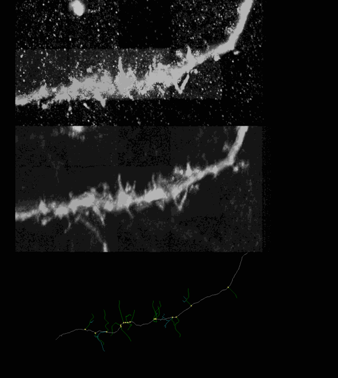
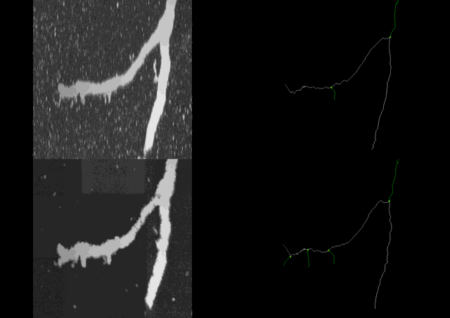
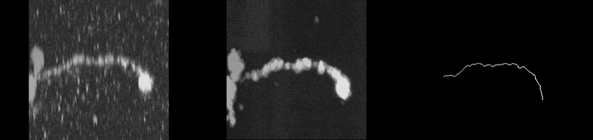
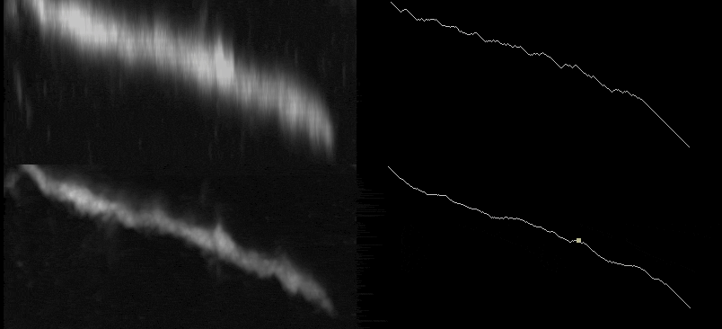

## Gallery

- More example cases shown as rotating 3D views. 
- In the labeled skeletons,white = trunk, yellow = branch points, green = longest branch, and cyan = other branches.

#### Example 1

Raw image (top), after enhancement (middle), and the traced skeleton (bottom). Enhancement makes the fine neurites much clearer, so the skeleton catches more thin branches.

#### Example 2

Raw image (top left), after enhancement (bottom left), and the traced skeleton (right). Enhancement makes the neurite clearer and removes noise and artifacts, so the skeleton can catch more of the fine branches.

#### Example 3

Raw image with slice loss from sampling (left), after enhancement (middle), and the traced skeleton (right). Enhancement fills in the missing slices, so the skeleton can be extracted.

#### Example 4

Raw image (top left), after enhancement (bottom left), and the traced skeletons (right). Axial blur makes the skeleton from the raw image jagged, while the enhanced image gives a smoother skeleton that catches more thin branches.
